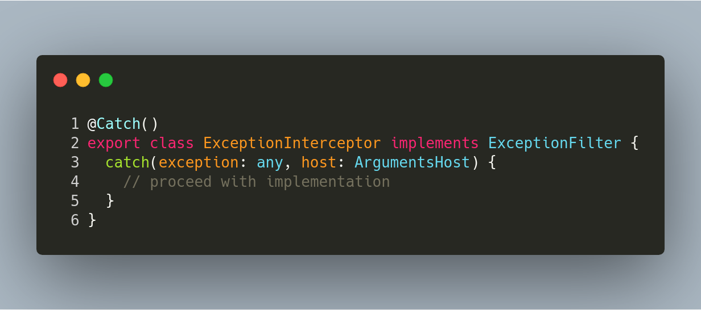
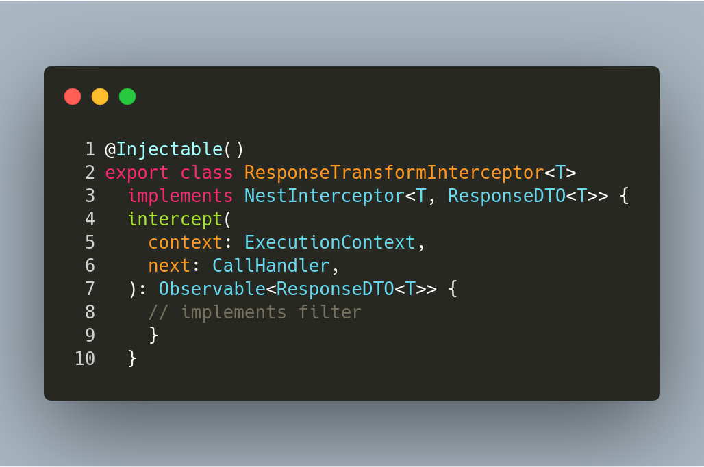

# Padrões de projeto: Backend

## Histórico de revisão

| **Data** | **Versão** | **Descrição** | **Autor(es)** |
|---|---|---|---|
|23/06/2019 | 0.1 | Adição de Padrões | Ícaro Oliveira, Guilherme Siqueira e Gustavo Braz |
|23/06/2019 | 0.2 | Adição de DTO, Pipes and Filters | Ícaro Oliveira, Guilherme Siqueira e Gustavo Braz |

## 1. Introdução
Este documento apresenta os padrões de projeto utilizados no backend. A estrutura dos padrões é segue o seguinte modelo: breve descrição do padrão, motivação e trecho de código como exemplo. 

É importante ressaltar que a implementação da arquitetura, tanto do projeto quanto do próprio *framework* adotado, foram pensados sob **princípios *SOLID*** no projeto.

## 2. Padrões Emergentes

### 2.1 Injeção de Dependência e Inversão de Controle

#### 2.1.1 Descrição
Injeção de dependência (Dependency Injection, em inglês) é um padrão de desenvolvimento de programas de computadores utilizado quando é necessário manter baixo o nível de acoplamento entre diferentes módulos de um sistema. 

Nesta solução as dependências entre os módulos não são definidas programaticamente, mas sim pela configuração de uma infraestrutura de software (container) que é responsável por "injetar" em cada componente suas dependências declaradas. A Injeção de dependência se relaciona com o padrão Inversão de controle mas não pode ser considerada um sinônimo deste.

#### 2.1.2 Motivação

Os *providers* são um conceito fundamental no Nest. Muitas das classes básicas do Nest podem ser tratadas como um *provider* - *services*, *repositories*, *factories*, *helpers* e assim por diante. A idéia principal de um *provider* é que ele pode **injetar dependências**. Isso significa que os objetos podem criar vários relacionamentos uns com os outros, e a função de instâncias "conectadas" de objetos pode ser amplamente delegada ao sistema de tempo de execução Nest. Um *provider* é simplesmente uma classe anotada com um decorador `@Injectable ()`.

**O Nest possui um contêiner de inversão de controle ("IoC")** integrado que resolve as relações entre *providers*.

A utilização desse padrão também possui uma visão de Single Responsibility Principle, dos princípios *SOLID*.

#### 2.1.3 Exemplo
No Conosco, toda classe do tipo *service* é anotada com o *decorator*  `@Injectable()` (mais explicações sobre esse padrão na seção [Decorator](#32-Decorator)), que indica que essa classe pode ser injetada em outros contêiners, caso necessário.

Por exemplo, no caso do módulo de `User`, a classe `UserService` é "decorada" como uma classe Injetável. Ela também utiliza-se desse modelo, onde o decorador `@InjectRepository()` é utilizado para indicar a injeção de um repositório (mais explicações sobre esse padrão na seção [Repository](#22-Repository)) de `User`.

Em seguida, ela pode ser injetada na classe `UserController`:

Agora, o contêiner (module) do `User` controla o registro da injeção de serviço nos seus provedores (linha 3). O módulo do `TypeOrm`, ORM utilizada no projeto, faz o controle do registro da injeção do repositório utilizado na `UserService` (linha 2).

### 2.2 Repository 
#### 2.2.1 Descrição

Essencialmente, esse padrão fornece uma abstração de dados, para que seu aplicativo possa trabalhar com uma abstração simples que tenha uma interface que se aproxima de uma coleção. 

Adicionar, remover, atualizar e selecionar itens dessa coleção é feito por meio de uma série de métodos simples, sem a necessidade de lidar com questões de banco de dados, como conexões, comandos, cursores ou leitores. Usar esse padrão pode ajudar a obter um acoplamento flexível e manter a persistência dos objetos de domínio ignorantes.

#### 2.2.2 Motivação

O TypeORM oferece duas formas de utilizar a interação com os dados: Active Record ou Repository. Este foi escolhido pois oferece maior flexibilidade caso haja alguma modificação na forma de lidar com os dados e também respeita um **baixo acoplamento** entre as classes. 

No projeto, havia a possibilidade de implementar um repositório customizado para cada entidade, mas resolveu-se utilizar o repositório provido pelo TypeOrm.

#### 2.2.3 Exemplo

Na classe `UserService`, são implementados métodos de negócio (procurar usuário por *email* ou retornar o *password* do usuario etc). Nesses métodos, é utilizado o repositório do usuário com os métodos fornecidos pelo repositório. No codigo abaixo: `findOneOrFail` nas linhas 2 e 19, `find` na linha 6 e `createQueryBuilder` na linha 11) são exemplos desses métodos.

#### 2.3 DTO
#### 2.3.1 Descrição
Um Objeto de Transferência de Dados é um objeto usado para encapsular dados e enviá-los de um subsistema de um aplicativo para outro.

Os DTOs são mais comumente usados ​​pela camada *services* em um aplicativo N-camadas para transferir dados entre ele e a camada da interface do usuário. O principal benefício aqui é que reduz a quantidade de dados que precisam ser enviados pela rede em aplicativos distribuídos.

#### 2.3.2 Motivação
Uma vez que o projeto possui um formato de N-camadas, as DTOs são utilizadas na comunicação entre o *app* e a API. Elas também são decoradas com as anotações `@ApiModelProperty()` do módulo de documentação Swagger e as que serão utilizadas pelo [filtro](#24-Pipes-and-Filters) de validação do módulo `class-validator`.

#### 2.3.3 Exemplo

No contexto de criação de um `Topic` (tópico ou postagem), é definida a `TopicDTO`, com as anotações do Swagger e `class-validator`.

Na `GroupController`, que serve apenas como uma [fachada](#34-Facade), ela recebe o `id` do grupo e a `TopicDTO` e envia os dados como parâmetro para `groupService.createTopic()`.

 Nesse método, a criação do tópico é transferida para o contexto de tópicos através do objeto `topicService`, uma vez que não é responsabilidade do grupo criar um tópico (pois não conversa com o `topicRepository`). Porém, está no contexto dele a adição de seus próprios tópicos.

Finalmente, na `TopicService`, o objeto é persistido no banco de dados.

#### 2.4 Pipes and Filters
#### 2.4.1 Descrição

Ele consiste em qualquer número de componentes (filtros) que transformam ou filtram dados, antes de transmiti-los via conectores (tubos) para outros componentes. Os filtros estão todos funcionando ao mesmo tempo.

O **filtro** transforma ou filtra os dados que recebe através dos tubos com os quais está conectado. Um filtro pode ter qualquer número de tubos de entrada e qualquer número de tubos de saída.

O **pipe** é o conector que passa os dados de um filtro para o próximo. É um fluxo direcional de dados.

#### 2.4.2 Motivação
No projeto, foram utilizados para três finalidades específicas: um *pipe* pra validação, um *filter* para respostas com sucesso e um *filter* para exceções.

#### 2.4.3 Exemplo

No *pipe* de validação: ele avalia os dados de entrada e, se forem válidos, simplesmente passa-os inalterados; caso contrário, lanca uma exceção quando os dados estiverem incorretos.

No Nest, os *pipes* são executados dentro da zona de exceções. Isso significa que, quando um *pipe* lança uma exceção, ele é tratado pela camada de exceções (*filtro* de exceções).

Quando uma exceção acontece, ela é lançada para o filtro de exceções e é enviada uma resposta para o cliente, interrompendo qualquer execução subsequente.

Esses filtros e tubos são instanciados na criação (*bootstrap*) do server, injetados no [Singleton](#31-Singleton) que coordena toda a instância da aplicação.

## 3. Padrões GOF

### 3.1 Singleton

#### 3.1.1 Descrição
#### 3.1.2 Motivação
#### 3.1.3 Exemplo

### 3.2 Decorator

#### 3.2.1 Descrição
#### 3.2.2 Motivação
#### 3.2.3 Exemplo

### 3.3 Observer

#### 3.3.1 Descrição
#### 3.3.2 Motivação
#### 3.3.3 Exemplo

### 3.4 Facade

#### 3.4.1 Descrição
#### 3.4.2 Motivação
#### 3.4.3 Exemplo

### 3.5 Strategy 

#### 3.5.1 Descrição
#### 3.5.2 Motivação
#### 3.5.3 Exemplo

### 3.6 Factory 

#### 3.6.1 Descrição
#### 3.6.2 Motivação
#### 3.6.3 Exemplo

### 3.7 Factory 

#### 3.7.1 Descrição
#### 3.7.2 Motivação
#### 3.7.3 Exemplo
