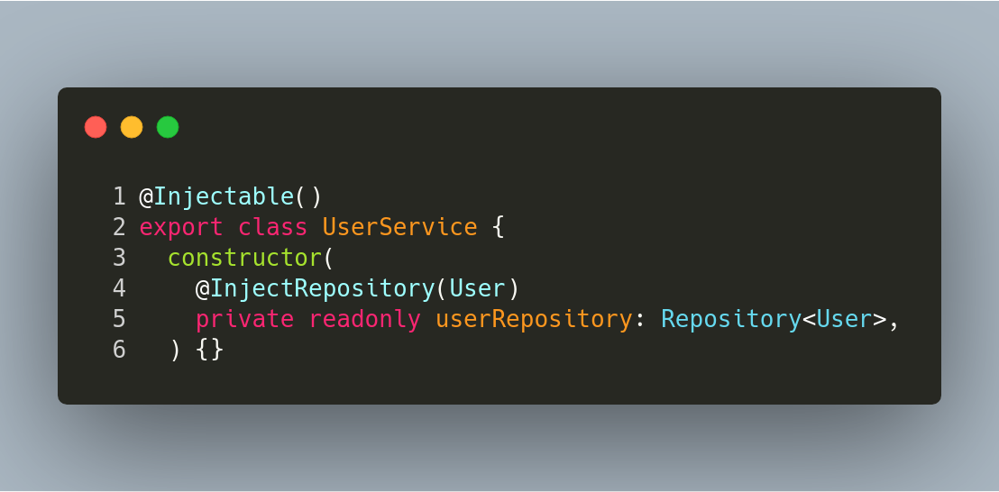
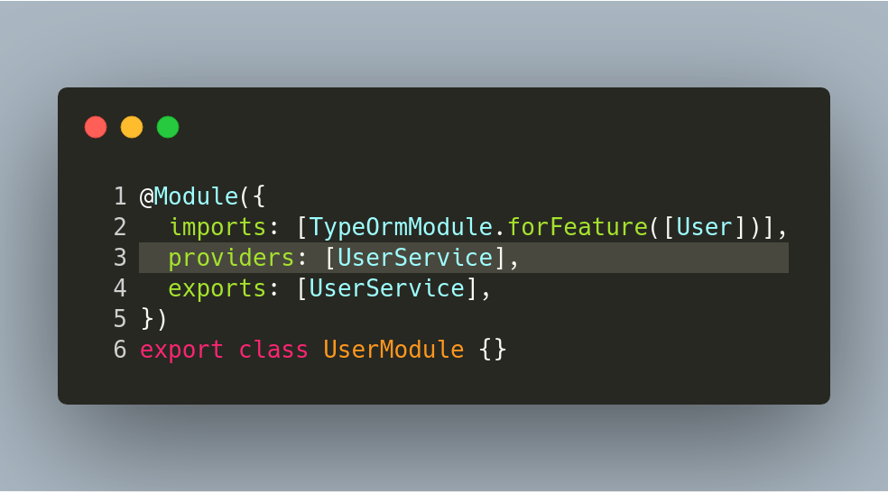
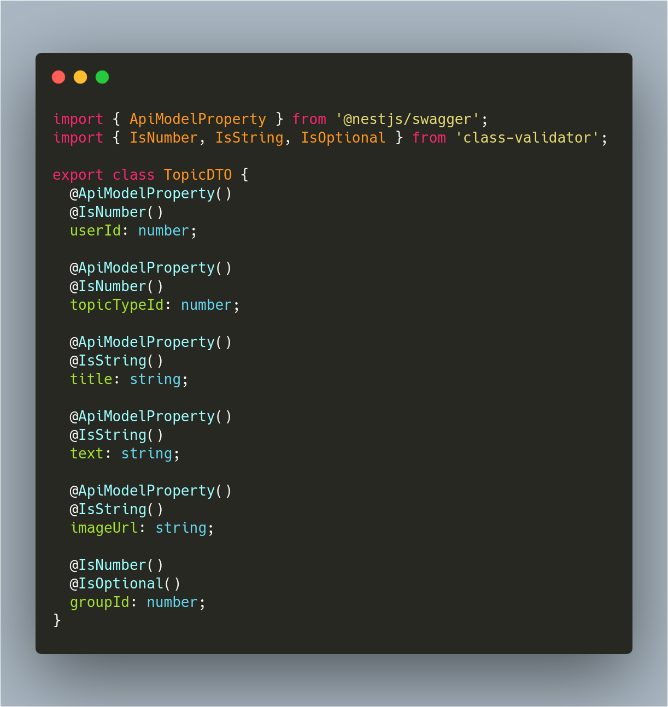
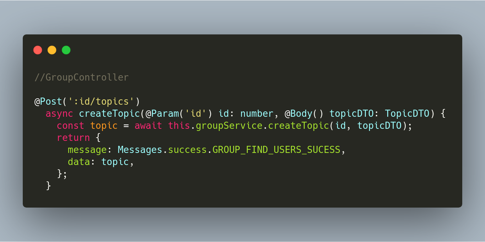
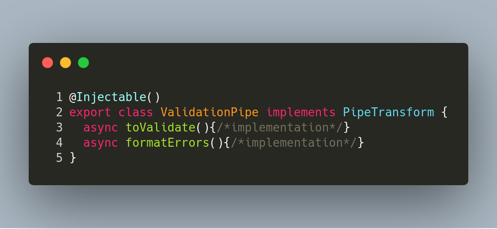
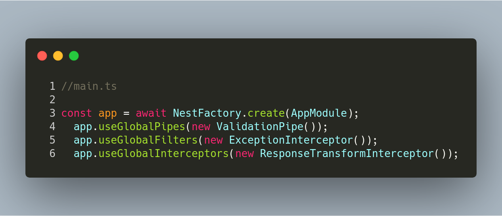

<!-- START doctoc generated TOC please keep comment here to allow auto update -->
<!-- DON'T EDIT THIS SECTION, INSTEAD RE-RUN doctoc TO UPDATE -->
**Table of Contents**  *generated with [DocToc](https://github.com/thlorenz/doctoc)*

- [Padrões de projeto: Backend](#Padr%C3%B5es-de-projeto-Backend)
  - [Histórico de revisão](#Hist%C3%B3rico-de-revis%C3%A3o)
  - [1. Introdução](#1-Introdu%C3%A7%C3%A3o)
  - [2. Padrões Emergentes](#2-Padr%C3%B5es-Emergentes)
    - [2.1 Injeção de Dependência e Inversão de Controle](#21-Inje%C3%A7%C3%A3o-de-Depend%C3%AAncia-e-Invers%C3%A3o-de-Controle)
      - [2.1.1 Descrição](#211-Descri%C3%A7%C3%A3o)
      - [2.1.2 Motivação](#212-Motiva%C3%A7%C3%A3o)
      - [2.1.3 Exemplo](#213-Exemplo)
    - [2.2 Repository](#22-Repository)
      - [2.2.1 Descrição](#221-Descri%C3%A7%C3%A3o)
      - [2.2.2 Motivação](#222-Motiva%C3%A7%C3%A3o)
      - [2.2.3 Exemplo](#223-Exemplo)
    - [2.3 DTO](#23-DTO)
      - [2.3.1 Descrição](#231-Descri%C3%A7%C3%A3o)
      - [2.3.2 Motivação](#232-Motiva%C3%A7%C3%A3o)
      - [2.3.3 Exemplo](#233-Exemplo)
    - [2.4 Pipes and Filters](#24-Pipes-and-Filters)
      - [2.4.1 Descrição](#241-Descri%C3%A7%C3%A3o)
      - [2.4.2 Motivação](#242-Motiva%C3%A7%C3%A3o)
      - [2.4.3 Exemplo](#243-Exemplo)
  - [3. Padrões GOF](#3-Padr%C3%B5es-GOF)
    - [3.1 Singleton](#31-Singleton)
      - [3.1.1 Descrição](#311-Descri%C3%A7%C3%A3o)
      - [3.1.2 Motivação](#312-Motiva%C3%A7%C3%A3o)
      - [3.1.3 Exemplo](#313-Exemplo)
    - [3.2 Decorator](#32-Decorator)
      - [3.2.1 Descrição](#321-Descri%C3%A7%C3%A3o)
      - [3.2.2 Motivação](#322-Motiva%C3%A7%C3%A3o)
      - [3.2.3 Exemplo](#323-Exemplo)
    - [3.3 Facade](#33-Facade)
      - [3.3.1 Descrição](#331-Descri%C3%A7%C3%A3o)
      - [3.3.2 Motivação](#332-Motiva%C3%A7%C3%A3o)
      - [3.3.3 Exemplo](#333-Exemplo)
    - [3.4 Strategy](#34-Strategy)
      - [3.4.1 Descrição](#341-Descri%C3%A7%C3%A3o)
      - [3.4.2 Motivação](#342-Motiva%C3%A7%C3%A3o)
      - [3.4.3 Exemplo](#343-Exemplo)
    - [3.5 Factory](#35-Factory)
      - [3.5.1 Descrição](#351-Descri%C3%A7%C3%A3o)
      - [3.5.2 Motivação](#352-Motiva%C3%A7%C3%A3o)
      - [3.5.3 Exemplo](#353-Exemplo)

<!-- END doctoc generated TOC please keep comment here to allow auto update -->

# Padrões de projeto: Backend

## Histórico de revisão

| **Data** | **Versão** | **Descrição** | **Autor(es)** |
|---|---|---|---|
|23/06/2019 | 0.1 | Adição do Padrões utilizados e esqueleto do documento | Ícaro Oliveira, Guilherme Siqueira e Gustavo Braz |
|23/06/2019 | 0.2 | Adição de descrição, motivação e exemplo de DI/IoC, Repository, DTO e Pipes and Filters | Ícaro Oliveira, Guilherme Siqueira e Gustavo Braz |
|25/06/2019 | 0.3 | Adição da descrição dos padrões Singleton, Decorator e Facade| Ana Carolina Carvalho |
|29/06/2019 | 1.0 | Adição de descrição, motivação e exemplo dos padrões Singleton, Decorator, Facade, Strategy e Factory| Ícaro Oliveira |

## 1. Introdução
Este documento apresenta os padrões de projeto utilizados no backend. A estrutura dos padrões é segue o seguinte modelo: breve descrição do padrão, motivação e trecho de código como exemplo.

É importante ressaltar que a implementação da arquitetura, tanto do projeto quanto do próprio *framework* adotado, foram pensados sob **princípios *SOLID*** no projeto.

## 2. Padrões Emergentes

### 2.1 Injeção de Dependência e Inversão de Controle

#### 2.1.1 Descrição
Injeção de dependência (Dependency Injection, em inglês) é um padrão de desenvolvimento de programas de computadores utilizado quando é necessário manter baixo o nível de acoplamento entre diferentes módulos de um sistema.

Nesta solução as dependências entre os módulos não são definidas programaticamente, mas sim pela configuração de uma infraestrutura de software (container) que é responsável por "injetar" em cada componente suas dependências declaradas. A Injeção de dependência se relaciona com o padrão Inversão de controle mas não pode ser considerada um sinônimo deste.

#### 2.1.2 Motivação

Os *providers* são um conceito fundamental no Nest. Muitas das classes básicas do Nest podem ser tratadas como um *provider* - *services*, *repositories*, *factories*, *helpers* e assim por diante. A idéia principal de um *provider* é que ele pode **injetar dependências**. Isso significa que os objetos podem criar vários relacionamentos uns com os outros, e a função de instâncias "conectadas" de objetos pode ser amplamente delegada ao sistema de tempo de execução Nest. Um *provider* é simplesmente uma classe anotada com um decorador `@Injectable ()`.

**O Nest possui um contêiner de inversão de controle ("IoC")** integrado que resolve as relações entre *providers*.

A utilização desse padrão também possui uma visão de Single Responsibility Principle, dos princípios *SOLID*.

#### 2.1.3 Exemplo
No Conosco, toda classe do tipo *service* é anotada com o *decorator*  `@Injectable()` (mais explicações sobre esse padrão na seção [Decorator](#32-Decorator)), que indica que essa classe pode ser injetada em outros contêiners, caso necessário.

Por exemplo, no caso do módulo de `User`, a classe `UserService` é "decorada" como uma classe Injetável. Ela também utiliza-se desse modelo, onde o decorador `@InjectRepository()` é utilizado para indicar a injeção de um repositório (mais explicações sobre esse padrão na seção [Repository](#22-Repository)) de `User`.

Em seguida, ela pode ser injetada na classe `UserController`:

Agora, o contêiner (module) do `User` controla o registro da injeção de serviço nos seus provedores (linha 3). O módulo do `TypeOrm`, ORM utilizada no projeto, faz o controle do registro da injeção do repositório utilizado na `UserService` (linha 2).

### 2.2 Repository
#### 2.2.1 Descrição

Essencialmente, esse padrão fornece uma abstração de dados, para que seu aplicativo possa trabalhar com uma abstração simples que tenha uma interface que se aproxima de uma coleção.

Adicionar, remover, atualizar e selecionar itens dessa coleção é feito por meio de uma série de métodos simples, sem a necessidade de lidar com questões de banco de dados, como conexões, comandos, cursores ou leitores. Usar esse padrão pode ajudar a obter um acoplamento flexível e manter a persistência dos objetos de domínio ignorantes.

#### 2.2.2 Motivação

O TypeORM oferece duas formas de utilizar a interação com os dados: Active Record ou Repository. Este foi escolhido pois oferece maior flexibilidade caso haja alguma modificação na forma de lidar com os dados e também respeita um **baixo acoplamento** entre as classes.

No projeto, havia a possibilidade de implementar um repositório customizado para cada entidade, mas resolveu-se utilizar o repositório provido pelo TypeOrm.

#### 2.2.3 Exemplo

Na classe `UserService`, são implementados métodos de negócio (procurar usuário por *email* ou retornar o *password* do usuario etc). Nesses métodos, é utilizado o repositório do usuário com os métodos fornecidos pelo repositório. No codigo abaixo: `findOneOrFail` nas linhas 2 e 19, `find` na linha 6 e `createQueryBuilder` na linha 11) são exemplos desses métodos.

### 2.3 DTO
#### 2.3.1 Descrição
Um Objeto de Transferência de Dados é um objeto usado para encapsular dados e enviá-los de um subsistema de um aplicativo para outro.

Os DTOs são mais comumente usados ​​pela camada *services* em um aplicativo N-camadas para transferir dados entre ele e a camada da interface do usuário. O principal benefício aqui é que reduz a quantidade de dados que precisam ser enviados pela rede em aplicativos distribuídos.

#### 2.3.2 Motivação
Uma vez que o projeto possui um formato de N-camadas, as DTOs são utilizadas na comunicação entre o *app* e a API. Elas também são decoradas com as anotações `@ApiModelProperty()` do módulo de documentação Swagger e as que serão utilizadas pelo [filtro](#24-Pipes-and-Filters) de validação do módulo `class-validator`.

#### 2.3.3 Exemplo

No contexto de criação de um `Topic` (tópico ou postagem), é definida a `TopicDTO`, com as anotações do Swagger e `class-validator`.

Na `GroupController`, que serve apenas como uma [fachada](#34-Facade), ela recebe o `id` do grupo e a `TopicDTO` e envia os dados como parâmetro para `groupService.createTopic()`.

 Nesse método, a criação do tópico é transferida para o contexto de tópicos através do objeto `topicService`, uma vez que não é responsabilidade do grupo criar um tópico (pois não conversa com o `topicRepository`). Porém, está no contexto dele a adição de seus próprios tópicos.

Finalmente, na `TopicService`, o objeto é persistido no banco de dados.

### 2.4 Pipes and Filters
#### 2.4.1 Descrição

Ele consiste em qualquer número de componentes (filtros) que transformam ou filtram dados, antes de transmiti-los via conectores (tubos) para outros componentes. Os filtros estão todos funcionando ao mesmo tempo.

O **filtro** transforma ou filtra os dados que recebe através dos tubos com os quais está conectado. Um filtro pode ter qualquer número de tubos de entrada e qualquer número de tubos de saída.

O **pipe** é o conector que passa os dados de um filtro para o próximo. É um fluxo direcional de dados.

#### 2.4.2 Motivação
No projeto, foram utilizados para três finalidades específicas: um *pipe* pra validação, um *filter* para respostas com sucesso e um *filter* para exceções.

#### 2.4.3 Exemplo

No *pipe* de validação: ele avalia os dados de entrada e, se forem válidos, simplesmente passa-os inalterados; caso contrário, lanca uma exceção quando os dados estiverem incorretos.

No Nest, os *pipes* são executados dentro da zona de exceções. Isso significa que, quando um *pipe* lança uma exceção, ele é tratado pela camada de exceções (*filtro* de exceções).

Quando uma exceção acontece, ela é lançada para o filtro de exceções e é enviada uma resposta para o cliente, interrompendo qualquer execução subsequente.

Esses filtros e tubos são instanciados na criação (*bootstrap*) do server, injetados no [Singleton](#31-Singleton) que coordena toda a instância da aplicação.

## 3. Padrões GOF

### 3.1 Singleton

#### 3.1.1 Descrição

No Singleton a ideia é ter uma classe-objeto que tenha no máximo uma única instância durante todo o ciclo de vida da aplicação. 

#### 3.1.2 Motivação

No Nest, os [módulos](https://docs.nestjs.com/modules) são singletons por padrão e, portanto, é possível compartilhar a mesma instância de qualquer provedor entre vários módulos sem esforço. Cada módulo é automaticamente um módulo compartilhado. Uma vez criado pode ser reutilizado por qualquer módulo.

#### 3.1.3 Exemplo

No exemplo abaixom, ao criar um grupo (linha 12) é necessário utilizar a classe `HabitService`. Para isso, é utilizada a instância do serviço no construtor do `GroupService` (perceba que não é utilizado `new` ao atribuir ao objeto `habitService`).

Essa classe foi exportada no módulo `HabitModule` (que é decorada como `@Module()`). 

E assim pôde ser injetada na classe de serviço `GroupService`, pois foi importada na `GroupModule`. É interessante destacar que os próprios módulos também foram encarregados de exportar seus serviços, indicar suas controllers (que serão consumidas no `AppModule` para serem expostas como endpoints RESTful) e importar outros módulos.

É também importado, inclusive, o próprio módulo do ORM, que se encarrega de instanciar a Entidade (model) que foi utilizada no `GroupService` para ser injetada como Repositório. 

### 3.2 Decorator

#### 3.2.1 Descrição

O Decorator nos permite anexar um comportamento a um objeto que já existe dinamicamente, ou seja, em tempo de execução. Sem alterar a sua estrutura, mantendo a assinatura dos métodos intacta. Sem a necessidade de fazer herança e, com isso, não criar um alto número de sub-classes.

#### 3.2.2 Motivação

O Nest faz um vasto uso de decoradores, pois é uma facilidade fornecida pelo próprio TypeScript. No TypeScript, podem ser decoradas classes, objetos ou métodos. São utilizados decoradores para extender as funcionalidades de uma classe anotada como `@Controller` e até mesmo para validação. 

Os decoradores são úteis para qualquer coisa que se queira envolver uma funcionalidade extra.

#### 3.2.3 Exemplo

Na classe `GroupController`, por exemplo, os decoradores são utilizados para vários fins: dar funcionalidades de documentação (para o módulo do Swagger) e dar os poderes de uma classe `@Controller`. 

Ao investigar o código do framework, verifica-se que ele utiliza esse decorador para implementar um decorador do tipo `ClassDecorator`.

### 3.3 Facade

#### 3.3.1 Descrição

O Facade trata de um encapsulamento de um subsistema complexo dentro de uma única interface. Reduzindo a curva de aprendizado. Outro benefício é o desacoplamento do subsistema. Se usado corretamente, haverá flexibilidade e recursos para o desenvolvimento de funções mais avançadas/complexas.

#### 3.3.2 Motivação

Foi utilizado o padrão para abstrair e simplificar a comunicação entre certas camadas do sistema. Especialmente entre a Controller e a Service e entre as próprias services. 

A controller serve apenas para receber as requisições e delegar para as services. Não é implementada nenhuma lógica de negócio nelas.

As respostas são transmitidas para a pipeline de respostas, onde o dado é transformado, empacotado e enviado para o cliente. 

#### 3.3.3 Exemplo

Na classe `GroupController`, por exemplo, ela apenas delega à `GroupService` o que deve ser feito. Caso alguma implementação aconteça na lógica de negócio, a forma em que o cliente envia ou recebe os dados não necessariamente poderá ser afetada. 

Outro exemplo é na comunicação entre as classes  `AuthService` e `UserService`. A classe encarregada de cuidar da autenticação do usuário não deve ser responsável também pela forma em que o usuário é armazenado ou manipulado (linha 4). Ela deve cuidar apenas de permitir ou não que ele seja autenticado no sistema. 

### 3.4 Strategy

#### 3.4.1 Descrição

Em vez de implementar um único algoritmo diretamente, o código recebe instruções em tempo de execução sobre qual família de algoritmos usar.

A strategy permite que o algoritmo varie independentemente dos clientes que o usam.

#### 3.4.2 Motivação

Ela foi utilizada para implementar algorítmos de autenticação.

Embora seja utilizado apenas uma estratégia, o modo como foi criado permite que sejam utilizados outros tipos de autenticação (como por Facebook ou Google, por exemplo).

#### 3.4.3 Exemplo
Na implementação da estratégia do JWT, ele extende a estratégia base do módulo Passport.

Agora, em módulos que indicam que quiserem registrar essa estratégia, é importado o módulo do Passport e indica-se a estratégia desejada (jwt, no caso.

### 3.5 Factory
#### 3.5.1 Descrição

A utilização do padrão Factory é útil quando você precisa criar objetos dinamicamente sem conhecer a classe de implementação, somente sua interface: o padrão factory estabelece uma forma de desenvolver objetos que são responsáveis pela criação de outros objetos. 

#### 3.5.2 Motivação

Este padrão é proposto pelo *framework* para a criação da instância da aplicação. A sua interface recebe como parâmetro o módulo-raiz na arquitetura, que é o `AppModule`, e a partir daí ela se encarrega de criar o que for necessário para instanciar o aplicativo.

#### 3.5.3 Exemplo

Importam-se os módulos no `AppModule`:

É utilizada a fábrica para criar o objeto `app` e este poder controlar outras funcionalidades do servidor, como configurar os [pipes and filters](#24-Pipes-and-Filters)

https://github.com/nestjs/nest/blob/5b552209a5a587ae7b58d0d7c50d022c2ed0055c/packages/core/nest-factory.ts#L32