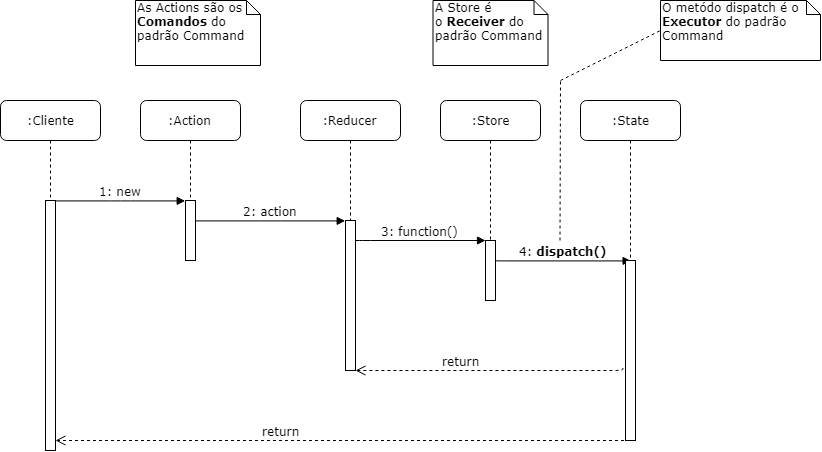

# Command

| **Data**   | **Versão** | **Descrição**               | **Autor(es)**  |
| ---------- | ---------- | --------------------------- | -------------- |
| 26/05/2019 | 0.1        | Adição da introdução e Command Pattern no React Native | Guilherme Siqueira, Gustavo Braz, Djorkaeff Alexandre, Ícaro de Oliveira, Augusto Vilarins e Ana Carolina |
| 26/05/2019 | 0.2        | Adição do diagrama de sequência | Gustavo Braz, Guilherme Siqueira |

## Introdução
A motivação deste padrão é reutilizar alguns pedaços de código já utilizados anteriormente, desacoplando o código, cujo é a sua principal função. Existem três papéis no Command Pattern, o *Receiver*, *Command* e o *Executor*.

## Command Pattern no *React Native*
No Conosco, o *Command Pattern* foi implementado seguindo o [Redux](https://redux.js.org/).

### *Receiver* = *Reducers*
O receptor é quem contem a lógica do negócio. Quando dado um comando, ele sabe exatamente os passos de como executá-lo. No Conosco utilizando o Redux, o *Receiver* é o ***reducers***, e o Store é instanciado com eles. Os reducers descrevem como o store muda. 
Reducers são funções puras que quando chamadas retornam um novo state, ao contrário de causar mutações. 

No Conosco, temos o exemplo abaixo de um Reducer:

```javascript
// reducers/user/index.js

export const initial = {
  loading: false,
  error: false,
};

const error = state => ({ ...state, error: true, loading: false });
const loading = state => ({ ...state, error: false, loading: true });
const result = state => ({ ...state, error: false, loading: false });

const user = (state = initial, action) => {
  switch (action.type) {
    case 'REQUEST_LOGIN':
      return loading(state);

    case 'ERROR_LOGIN':
      return error(state);
    
    case 'USER_RECEIVED':
      return result({ ...state, ...action.payload });

    default:
      return state;
  }
};

export default user;
```

```javascript
// reducers/index.js
import { combineReducers } from 'redux';

import user from './user';

export default combineReducers({
  user,
});
```

### *Command* = *actions*
Contém informações de como a ação está sendo chamado e seus parâmetros requeridos. É representado como um objeto. As actions representam a descrição do comando e dos parâmetros necessários para executar a mudança do state.

No Conosco, temos o exemplo abaixo de uma *action*:

```javascript
// /actions/user/actionCreators.js
export const requestLogin = () => ({
  type: 'REQUEST_LOGIN',
});

export const errorLogin = () => ({
  type: 'ERROR_LOGIN',
});
```

### *Executor*  =  *Dispatch*
O executor é uma interface para executar os comandos. O trabalho do executor é passar o comando para o receptor e chamar nossa lógica de negócios. O método Dispatch da Store pode despachar ações para alterar o estado de nossa aplicação.

No Conosco, temos o exemplo abaixo de um Dispatch:

```javascript
// /actions/user/index.js
// Dispatch da action para realizar login
export const logIn = (navigation) => (dispatch) => {
  Facebook.logInWithReadPermissionsAsync('2279625532289242', {
    permissions: ['public_profile', 'email'],
  }).then(({ type, token }) => {
    if (type === 'success') {
      getFacebookUserInfo(token)
        .then(({ firstName, profilePic }) => {
          dispatch(UserAC.userReceived({
            name: firstName,
            profilePic: profilePic.data.url,
          }));
          Alert.alert('Bem vindo!', `Que bom que você está conosco, ${firstName}!`);
          navigation.navigate('Dashboard');
        })
        .catch(error => console.log('error: ', error));
    } else {
      Alert.alert('Você cancelou seu login com o Facebook');
    }
  }).catch(({ message }) => Alert.alert(`Facebook Login Error: ${message}`));
}
```
## Diagrama de Sequência


